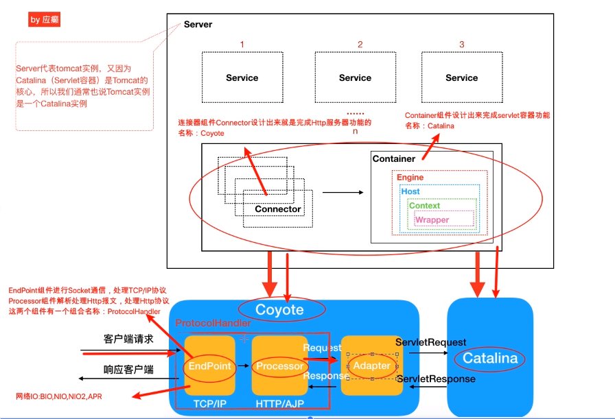

# Tomcat源码剖析课程笔记

## Part1：Tomcat整体架构

### Tomcat功能（需求）

HTTP服务器：处理socket通信，解析HTTP报文

Servlet容器：容器自带的Servlet，自定义Servlet（Servlet处理具体业务逻辑）

### Tomcat设计

Connector：完成HTTP服务器功能，名称：Coyote

Container：完成Servlet容器功能，名称：Catalina

#### Coyote

EndPoint：处理TCP/IP协议，进行SOCKET通信

Processor：处理HTTP协议，解析HTTP报文

EndPoint 和 Processor 合称为`ProtocolHandler`

##### 网络IO模型

Tomcat支持的IO模型：BIO，NIO，NIO2，APR

Tomcat 8 开始，默认使用NIO模型，APR需要在Linux上安装模块后再配置开启

